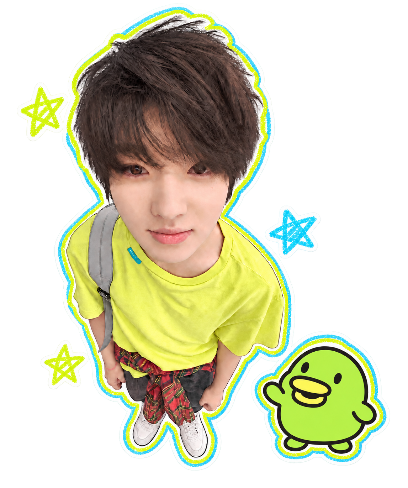

# Pocket Companion · 口袋搭子

一个轻量的 Windows / macOS 桌面陪伴小程序。照片人物配上黄绿色、浅蓝色蜡笔描边，旁边是平滑卡通风格的大嘴吉（Kuchipatchi），透明背景，可以拖动、点按和喂小饼干。



## 下载与运行

在仓库的 **Releases** 页面下载 `PocketCompanion-windows-v0.1.0.zip`，完整解压后双击 `StickerDuo.exe`。程序和 `duo.png` 必须位于同一文件夹，无需安装。

目标环境为 Windows 10/11 桌面与 .NET Framework 4.x。本版本在 Windows 上完成编译、功能自检及透明窗口渲染检查。

### macOS

macOS 12 或以上，Apple Silicon（M 系列）与 Intel 共用一个通用应用包。Mac 版采用 Swift / AppKit 实现，不运行 Windows EXE。下载 Releases 中的 `PocketCompanion-macOS-universal-v0.2.0.zip`，解压后将 `Pocket Companion.app` 拖入“应用程序”并打开。构建进度见仓库 Actions 页面。

保留照片素材、透明窗口、日语文字、喂食、拖动、大小调整、短句编辑和位置保存。Mac 顶部菜单栏的饼干图标可找回隐藏的桌宠，Control 点击或右键打开菜单。设置保存在 `~/Library/Application Support/PocketCompanion/settings.json`。

当前包仅有本地临时签名，尚未使用 Apple Developer ID 签名或公证。首次下载打开可能被 macOS 拦截；确认来源为本仓库后，可在系统设置的“隐私与安全性”中使用“仍要打开”。不需要关闭系统安全保护。

Mac 本地构建需 Xcode Command Line Tools：

```sh
bash macos/build.sh
```

GitHub Actions 编译通用包，并分别在 Apple Silicon 和 Intel runner 上运行状态逻辑自检和 AppKit 窗口渲染检查。这些检查不替代真实 Mac 上的完整鼠标交互验收。

## 互动

| 操作 | 效果 |
| --- | --- |
| 点击人物 | 弹跳并轮流显示一句日语短句 |
| 按住人物拖动 | 移动整个组合，并保存位置 |
| 拖底部饼干到大嘴吉 | 吃饼干、嘴部动画和饼干碎屑 |
| 右键 | 编辑短句、调整大小、隐藏或退出 |
| 双击系统托盘图标 | 找回隐藏的桌宠 |

默认尺寸为最初设计的 50%，可切换 40%、50%、70%、100%、120%。短句一行一句，最多 100 句、每句 36 个字符，可自行改成其他语言。

默认日语包括「今日はどんな一日だった？」「ちょっと休憩しよ。」「何か音楽でも聴く？」「ここにいるよ。」喂食时回应「クッキー、ありがとう！」。

## 本地构建

无需额外 npm 或 Python 依赖。双击 `build.cmd` 编译，或在命令提示符执行：

```bat
build.cmd test
```

产物位于 `dist`。自检覆盖喂食命中与落空、短句轮换、设置读写与损坏恢复、素材透明度、透明窗口创建和渲染。

## 文件结构

- `src/Duo.cs`：WinForms 程序、互动状态、绘制和本地设置。
- `assets/duo.png`：当前组合素材。
- `assets/preview.png`：程序直接渲染的预览。
- `build.cmd`：Windows 编译与自检入口。

## 当前范围

这是个人使用的首版。人物与大嘴吉目前是一张组合贴图，一起移动和弹跳；喂食效果由嘴部开合与碎屑叠加实现。日语是文字短句，没有配音或 AI 聊天。尚未实现网页定制器、自动抠图和一键导出其他人的桌宠。

程序离线运行，不上传照片，不添加开机启动。位置、大小、短句和喂食次数保存在 `%LOCALAPPDATA%\PhotoStickerDuo\settings.xml`。

照片及角色素材不代表获得第三方再分发授权。本仓库暂未附加开源许可证。
